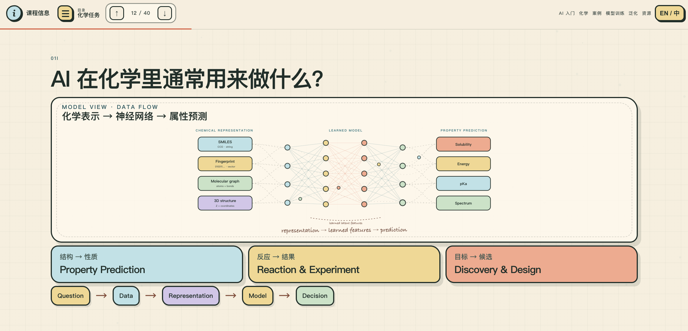

<div align="center">

# AI4S-Chem

### 人工智能技术入门 · AI 模型训练
### Introduction to Artificial Intelligence · AI Model Training

一个面向 AI 初学者的双语交互式课程网站：从基本概念、模型训练与泛化出发，逐步连接到真实的 AI × Chemistry 科研案例，并以线上 Notebook 完成一次动手实践。

A bilingual, interactive course for AI beginners — from core concepts, model training and generalization to real AI × Chemistry research cases and a hands-on online notebook.

<br>

### 👥 贡献者 / Contributors

**排名不分先后，贡献同等重要。**  
*Listed in no particular order; contributions are valued equally.*

<table>
  <tr>
    <td align="center" width="220">
      <a href="https://github.com/windyduan">
        <br>
        <sub><b>windyduan</b></sub>
      </a>
    </td>
    <td align="center" width="220">
      <a href="https://github.com/azukidot">
        <br>
        <sub><b>azukidot</b></sub>
      </a>
    </td>
    <td align="center" width="220">
      <a href="https://github.com/zhuyuyang0923">
        <br>
        <sub><b>zhuyuyang0923</b></sub>
      </a>
    </td>
    <td align="center" width="220">
      <a href="https://chatgpt.com/">
        <br>
        <sub><b>ChatGPT</b></sub><br>
        <sub>AI-assisted contributor</sub>
      </a>
    </td>
  </tr>
</table>

### 🙏 致谢 / Acknowledgements

感谢所有在课程设计、内容讨论、资料核查、技术实现、试讲、测试与改进过程中提供指导、建议与帮助的老师、同学和朋友。  
*We also thank everyone who provided guidance, feedback, review, testing, and support throughout the development of this course.*

<br>

[](https://ai4s.do123.eu.org/)
[](https://ai4s.do123.eu.org/)
[](https://ai4s.do123.eu.org/)
[](https://modelscope.cn/gallery/tjyyyyy/6dbd8253-830a-42af-bd98-102213c12018)

**[🌐 在线课程 / Live Course](https://ai4s.do123.eu.org/)** · **[🧪 在线 Notebook / Hands-on Notebook](https://modelscope.cn/gallery/tjyyyyy/6dbd8253-830a-42af-bd98-102213c12018)** · **[📚 来源与引用 / Sources](./SOURCES.md)**

[简体中文](#简体中文) · [English](#english)

<br>

<a href="https://ai4s.do123.eu.org/"></a>

</div>

> [!NOTE]
> ### 🌱 给初学者 / For beginners
> **计算机没有黑魔法。** 借用[浙江大学翁恺老师](https://person.zju.edu.cn/wengkai)面向初学者的教学态度：计算机里的概念、工具和系统，归根到底都是人设计和创造出来的。今天看不懂某个名词、模型或代码，并不意味着你“不适合”计算机或 AI；它只说明你还没有把它拆开、试过、问明白。**不要因为暂时不懂，就先否定自己。** 一步一步去问、去试、去验证，你完全可以理解它、使用它，也可以创造新的东西。
>
> **There is no black magic in computing.** The concepts, tools, and systems we use were designed and built by people. Not understanding a term, model, or piece of code yet does not mean you are “not made for” AI or computing. It only means you have not unpacked it yet. Ask, experiment, verify, and keep going — one step at a time.

---

# 简体中文

## ✨ 这是什么？

AI4S-Chem 是一个为 **第一次系统接触 AI 的学习者** 设计的交互式课程项目。

它不试图在一个上午讲完所有 AI 技术，也不要求学习者记住大量模型、框架和热点名词。课程更关心几个能够长期使用的问题：

> **数据是什么？模型在学什么？结果是怎么验证的？**

课程使用网页动画、交互图示、真实科研案例和 Notebook 实操，把抽象概念逐步落到可以观察、操作和讨论的对象上。

### 课程希望学习者带走什么？

- 对 **AI / Machine Learning / Deep Learning** 建立基本但不混乱的心智模型；
- 理解一个机器学习问题中的 **数据、表示、模型、损失、训练与预测**；
- 知道为什么 **训练效果好 ≠ 对新数据可靠**；
- 能读懂 Train / Validation / Test、Batch、Epoch、MAE、RMSE、R² 等常见术语；
- 看到一个 AI 科研工作时，会主动追问数据来源、验证方式和适用范围；
- 了解 AI 如何进入化学、材料、谱学、模拟、知识图谱和科研工作流；
- 最后亲手运行一次 Notebook，把“看懂”变成“做过”。

---

## 🚀 立即体验

| 入口 | 内容 | 推荐用途 |
| --- | --- | --- |
| **[互动课程网站](https://ai4s.do123.eu.org/)** | 16:9 / presentation-like 交互页面，中英文切换，动画与案例演示 | 课堂讲授、投影、自学回看 |
| **[ModelScope 在线 Notebook](https://modelscope.cn/gallery/tjyyyyy/6dbd8253-830a-42af-bd98-102213c12018)** | 在线运行代码并观察模型训练与结果 | 课程最后的动手实践 |
| **[SOURCES.md](./SOURCES.md)** | 课程使用和推荐的论文、项目、课程与资料来源 | 查证、延伸阅读 |

> [!TIP]
> 第一次使用建议先完整浏览课程主线，再进入 Notebook。网页负责建立直觉，Notebook 负责把概念落到实际运行过程。

---

## 🧭 课程地图

### Part 1 · 人工智能技术入门

课程先从“模型到底在做什么”开始，再进入化学科研场景。

```text
为什么要懂一点 AI？
        ↓
AI / ML / DL
        ↓
数据 · 标签 · 特征 · 模型 · Loss
        ↓
化学对象怎样表示？
        ↓
Representation ≠ Model
        ↓
图神经网络 · 三维几何 · 对称性
        ↓
AI 在化学中可以做什么？
        ↓
真实科研案例
        ↓
Agent：模型 + 工具 + 工作流 + 人工核查
```

### Part 2 · AI 模型训练

第二部分把一个模型的训练过程拆开，并把重点放到 **泛化与可信评估** 上。

```text
x · y · ŷ · θ
        ↓
Prediction → Loss → Update
        ↓
Batch size · Epoch
        ↓
Train / Validation / Test
        ↓
Underfitting ↔ Overfitting
        ↓
科研任务中的数据划分
        ↓
Evaluation traps
        ↓
MAE · RMSE · R²
        ↓
新样本的预测可靠吗？
```

课程最后回到一个简单的检查框架：

> **What is the data? → What did the model learn? → How was the result validated?**

---

## 🔬 AI × Chemistry：真实案例

课程中的案例尽量使用论文原文、官方项目页和可追溯来源，而不是只展示概念性的“AI 可以做什么”。

| 案例 | 核心问题 | 课程中关注的 AI 角色 | 状态 |
| --- | --- | --- | --- |
| **NMRNet** | 从局域三维原子环境预测 NMR 化学位移 | 3D representation · SE(3) Transformer · pretrain / fine-tune | Nature Computational Science, 2025 |
| **电解液 uMLP** | 用机器学习势扩大分子动力学模拟的时间与体系尺度 | concurrent learning · DeepPot-SE · MLMD | Nature Communications, 2026 |
| **Cat-KG + LLM** | 从大量催化文献中寻找可追溯的候选路线 | LLM extraction · knowledge graph · expert rules | National Science Review, 2025 |
| **NOSE** | 联合表示分子、嗅觉受体和气味语言 | multimodal learning · contrastive alignment | ACL 2026 Long Paper |
| **Uni-XAS** | 连接 XAS 光谱与局域三维结构 | cross-modal alignment · retrieval · conditional generation | ACM MM 2026 · Preprint |
| **电子电镀研发智能体** | 把多个专业模型、预测、筛选和实验组织成研发流程 | specialist models · tool orchestration · iterative R&D | Official Project, 2026 |

详细条目与原始链接见 [`data/research.json`](./data/research.json)。

> [!NOTE]
> 最后一个案例是公开的联合研发项目，不作为已发表论文介绍。课程也尽量区分 **已发表论文、会议论文 / 预印本和官方项目**。

---

## 🧩 为什么使用动画与交互？

这个项目把网页当作一种 **可操作的讲义 / presentation**，而不是给静态 PPT 加装饰动画。

交互只在它能够帮助理解时出现：

- **scroll** → 展开一个概念或科研流程；
- **click** → 切换表示方式、案例步骤或状态；
- **drag / controls** → 改变模型行为并观察结果；
- **animation** → 表现训练、数据流、几何关系或迭代过程。

设计上优先保证：

**一屏可读 · 投影可读 · 中文优先 · 逻辑连续 · 动画不过载 · 来源可追溯**

---

## 🤖 关于 Agent

课程把 Agent 当作一个 **工作流概念**，而不是某个产品或框架的广告。

一个适合入门的理解方式是：

```text
Goal
  ↓
Model / Reasoning
  ↓
Search · Database · Code · Files · Specialist Models · Simulation
  ↓
Intermediate results
  ↓
Human review / Experimental evidence
```

重点不是记住某个 Agent SDK，而是理解：**模型怎样调用工具、怎样组织多步任务，以及哪些中间结果必须被检查。**

---

## 🧪 Notebook 实操

线上 Notebook 是课程的最后一环。

学习者在看过网页中的训练、泛化和评估动画后，再亲自运行代码，可以把：

```text
数据 → 模型 → 训练 → 指标 → 结果```

从一条“听过的流程”变成实际操作。

**[打开 ModelScope Notebook →](https://modelscope.cn/gallery/tjyyyyy/6dbd8253-830a-42af-bd98-102213c12018)**

课堂使用时建议提前确认账号、网络和运行环境，并保留一份已经成功运行的结果作为现场备用。

---

## 🛠️ 本地运行

本项目是静态 HTML / CSS / JavaScript 教学网站，当前不需要额外的前端构建步骤。

```bash
git clone https://github.com/windyduan/AI4S-Chem.git
cd AI4S-Chem
python -m http.server 8000
```

然后访问：

```text
http://localhost:8000
```

建议使用本地 HTTP server，而不是直接双击 `index.html`，因为页面包含 JSON 数据与模块化资源加载。

---

## 📁 仓库结构

```text
AI4S-Chem/
├── index.html                  # 页面基础结构
├── app.js                      # 主交互逻辑
├── app-resources.js            # 资源页渲染与部分页面增强
├── story-effects.js            # 课程模块加载入口
├── content-tone-cleanup.js     # 最终课程文案与显示层统一
│
├── js/course/                  # 课程页面与交互模块
├── css/course/                 # 对应页面样式
│
├── data/
│   ├── research.json           # 科研案例与原始链接
│   ├── resources.json          # 课后学习资源
│   └── reviews.json            # 综述 / 延伸阅读
│
├── content/                    # 课程内容资料
├── SOURCES.md                  # 来源、引用与 attribution 说明
├── COLLABORATION.md            # 协作说明
└── README.md
```

项目由多个页面增强模块逐步演化而来，因此修改课程页面时应以 **真实浏览器渲染结果** 和当前加载链为准，避免只根据单个文件推断最终画面。

---

## 📚 来源、引用与内容原则

科研教学内容尤其需要区分“讲得顺”和“讲得对”。本项目尽量遵守以下原则：

- 优先链接论文原文、官方项目页、官方仓库与一手资料；
- 课程中的论文与项目描述使用重新组织后的教学表述，不大段复制原文；
- 区分 Published / Conference / Preprint / Official Project 等状态；
- 第三方资源卡保留项目名称、来源、官方链接与核验信息；
- 不因为课程中出现某个工具、项目或组织，就暗示其对本课程提供背书；
- 不把具体 AI 产品或 Agent 框架包装成唯一推荐答案。

完整记录见 **[`SOURCES.md`](./SOURCES.md)**。

---

## 🌱 课后继续学习

课程资源页包含不同方向的入门与延伸材料，例如：

- AI / 数学直觉：RethinkFun、3Blue1Brown；
- 深度学习：Dive into Deep Learning、Neural Networks: Zero to Hero；
- 软件工程基础：The Missing Semester；
- LLM / Agents：Hello-Agents、Happy-LLM、Hugging Face Agents Course；
- AI for Science：AI4Science101、Awesome AI for Science；
- AI × Chemistry / Materials：DeepChem、RDKit、Chemprop、SchNetPack、FAIRChem、pymatgen 等。

这些链接用于帮助学习者继续探索，不代表课程对相关平台、框架或组织的商业推荐。

---

## 🤝 协作

如果需要继续调整页面、补充案例或完善内容，建议先阅读 [`COLLABORATION.md`](./COLLABORATION.md) 和 [`SOURCES.md`](./SOURCES.md)。

对于科研案例，欢迎优先提交：

- 可核验的一手来源；
- 更准确、对初学者更友好的表述；
- 不牺牲科学边界的简化方式；
- 能真正帮助理解的交互或可视化。

---

# English

## ✨ What is AI4S-Chem?

AI4S-Chem is a bilingual, interactive course designed for learners who are encountering AI systematically for the first time.

The goal is **not** to cover every modern AI model, framework, or buzzword in one session. Instead, the course builds a reusable way to inspect AI work:

> **What is the data? What did the model learn? How was the result validated?**

Interactive web pages, visual explanations, real research cases, and an online notebook are used together so that abstract concepts become observable and actionable.

### Learning goals

By the end of the course, learners should be able to:

- distinguish the basic roles of **AI, machine learning, and deep learning**;
- identify data, representations, models, losses, training, and predictions in a simple ML workflow;
- explain why strong training performance does not guarantee reliable generalization;
- recognize common terms such as Train / Validation / Test, Batch, Epoch, MAE, RMSE, and R²;
- ask sensible questions about data provenance, evaluation, and applicability when reading AI research;
- see how AI methods enter chemistry, materials science, spectroscopy, simulation, knowledge graphs, and research workflows;
- run a small end-to-end notebook instead of only watching a demonstration.

---

## 🚀 Quick start

| Entry | What it contains | Best for |
| --- | --- | --- |
| **[Interactive course](https://ai4s.do123.eu.org/)** | Presentation-like 16:9 pages, bilingual content, animations and research cases | Lectures, projection, self-study |
| **[ModelScope Notebook](https://modelscope.cn/gallery/tjyyyyy/6dbd8253-830a-42af-bd98-102213c12018)** | Online code execution for hands-on model training and inspection | Final hands-on session |
| **[SOURCES.md](./SOURCES.md)** | Papers, projects, courses and references used by the course | Verification and further reading |

---

## 🧭 Course map

### Part 1 · Introduction to Artificial Intelligence

```text
Why learn some AI?
        ↓
AI / ML / DL
        ↓
Data · Labels · Features · Models · Loss
        ↓
How can chemical objects be represented?
        ↓
Representation ≠ Model
        ↓
Graphs · 3D geometry · Symmetry
        ↓
What can AI do in chemistry?
        ↓
Real research cases
        ↓
Agents: models + tools + workflows + human verification
```

### Part 2 · AI Model Training

```text
x · y · ŷ · θ
        ↓
Prediction → Loss → Update
        ↓
Batch size · Epoch
        ↓
Train / Validation / Test
        ↓
Underfitting ↔ Overfitting
        ↓
Scientific data splitting
        ↓
Evaluation traps
        ↓
MAE · RMSE · R²
        ↓
Can we trust a prediction on a new sample?
```

---

## 🔬 Research cases

The research section uses papers and official project sources rather than purely hypothetical examples.

| Case | Scientific question | AI role emphasized in the course | Status |
| --- | --- | --- | --- |
| **NMRNet** | Predict NMR chemical shifts from local 3D atomic environments | 3D representation · SE(3) Transformer · pretrain / fine-tune | Nature Computational Science, 2025 |
| **Electrolyte uMLP** | Extend atomistic simulation with a machine-learning potential | concurrent learning · DeepPot-SE · MLMD | Nature Communications, 2026 |
| **Cat-KG + LLM** | Find traceable catalytic routes across large literature collections | LLM extraction · knowledge graph · expert rules | National Science Review, 2025 |
| **NOSE** | Connect molecules, olfactory receptors, and odor language | multimodal learning · contrastive alignment | ACL 2026 Long Paper |
| **Uni-XAS** | Connect XAS spectra with local 3D structures | cross-modal alignment · retrieval · conditional generation | ACM MM 2026 · Preprint |
| **Electroplating R&D Agent** | Coordinate specialist models, screening, and experiments in formulation R&D | specialist models · tool orchestration · iterative R&D | Official Project, 2026 |

See [`data/research.json`](./data/research.json) for detailed entries and original links.

---

## 🧩 Interaction as teaching, not decoration

The website is designed as an **interactive handout / presentation**, not a static slide deck with decorative motion.

Interactions are used when they clarify a concept:

- **scroll** reveals conceptual or scientific progression;
- **click** changes representations, case steps, or states;
- **drag / controls** change model behavior and expose consequences;
- **animation** visualizes training, data flow, geometry, or iteration.

The main design constraints are:

**single-screen readability · projection readability · bilingual clarity · logical continuity · restrained motion · traceable sources**

---

## 🤖 A framework-neutral view of Agents
The course treats an Agent as a workflow concept rather than an advertisement for a specific framework or vendor.

```text
Goal
  ↓
Model / Reasoning
  ↓
Search · Database · Code · Files · Specialist Models · Simulation
  ↓
Intermediate results
  ↓
Human review / Experimental evidence
```

The important questions are how tools are called, how multi-step work is coordinated, and which intermediate results still require verification.

---

## 🧪 Hands-on Notebook

The online notebook closes the loop between visual intuition and actual execution:

```text
Data → Model → Training → Metrics → Results
```

**[Open the ModelScope Notebook →](https://modelscope.cn/gallery/tjyyyyy/6dbd8253-830a-42af-bd98-102213c12018)**

For classroom use, it is a good idea to verify accounts, network access, and the runtime environment in advance, and to keep one successfully executed copy as a fallback.

---

## 🛠️ Run locally

The course is a static HTML / CSS / JavaScript website and currently requires no separate frontend build step.

```bash
git clone https://github.com/windyduan/AI4S-Chem.git
cd AI4S-Chem
python -m http.server 8000
```

Then open:

```text
http://localhost:8000
```

Use a local HTTP server instead of opening `index.html` directly because the site loads JSON data and modular resources.

---

## 📁 Repository layout

```text
AI4S-Chem/
├── index.html
├── app.js
├── app-resources.js
├── story-effects.js
├── content-tone-cleanup.js
├── js/course/
├── css/course/
├── data/
│   ├── research.json
│   ├── resources.json
│   └── reviews.json
├── content/
├── SOURCES.md
├── COLLABORATION.md
└── README.md
```

The project has evolved through multiple teaching-page modules. When changing a page, inspect the actual browser rendering and the current loading chain rather than assuming that one source file alone defines the final result.

---

## 📚 Sources and content principles

The project prioritizes scientific traceability:

- prefer papers, official project pages, official repositories, and other primary sources;
- paraphrase and redesign material for teaching rather than reproducing long passages or figures;
- distinguish Published / Conference / Preprint / Official Project status;
- retain canonical names, owners, official links, and verification information for external resources;
- do not imply endorsement from organizations merely because their work is linked;
- do not present a particular AI product or Agent framework as the only recommended solution.

See **[`SOURCES.md`](./SOURCES.md)** for the source and attribution record.

---

## 🌱 Further learning

The resource section includes beginner-friendly and research-oriented material across several directions:

- AI and mathematical intuition: RethinkFun, 3Blue1Brown;
- deep learning: Dive into Deep Learning, Neural Networks: Zero to Hero;
- software-engineering foundations: The Missing Semester;
- LLMs and Agents: Hello-Agents、Happy-LLM、Hugging Face Agents Course;
- AI for Science: AI4Science101, Awesome AI for Science;
- AI × Chemistry / Materials: DeepChem、RDKit、Chemprop、SchNetPack、FAIRChem、pymatgen, and more.

These links are provided for learning and exploration and do not constitute commercial endorsement.

---

## 🤝 Collaboration

Before making substantial content or page changes, see [`COLLABORATION.md`](./COLLABORATION.md) and [`SOURCES.md`](./SOURCES.md).

Contributions are especially welcome when they provide:

- stronger primary-source verification;
- clearer explanations for beginners;
- simplification without losing scientific boundaries;
- interactions or visualizations that materially improve understanding.

---

<div align="center">

**Understand the data · Understand the model · Verify the result**

</div>
