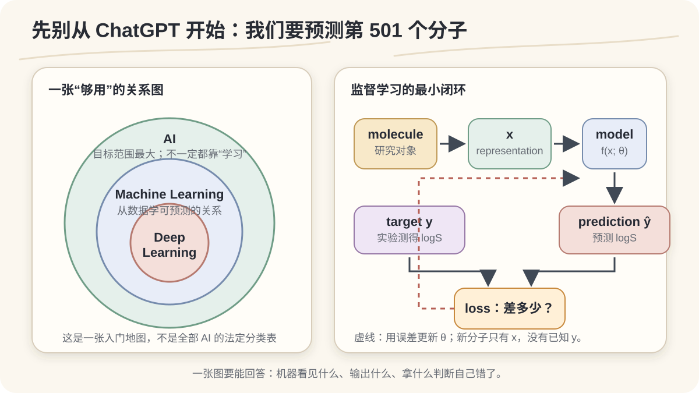
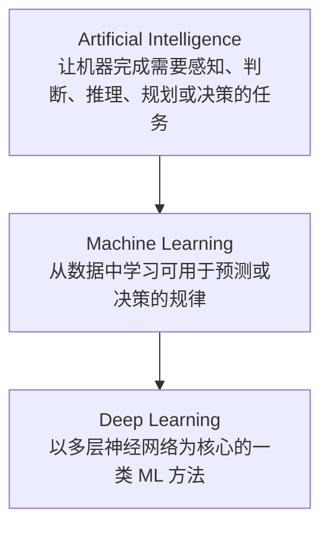
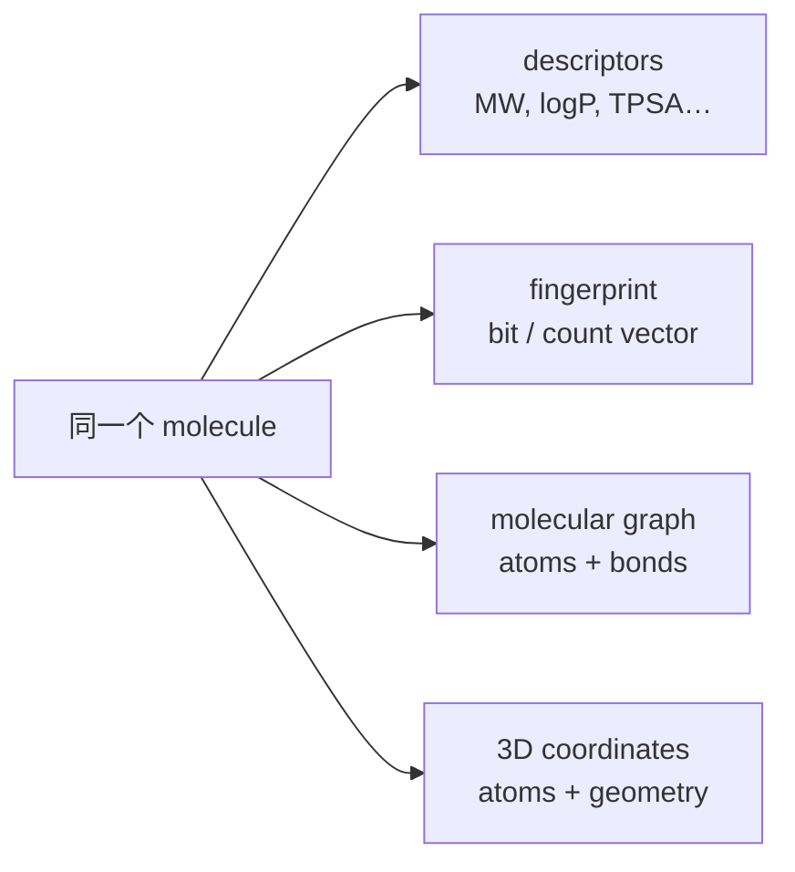
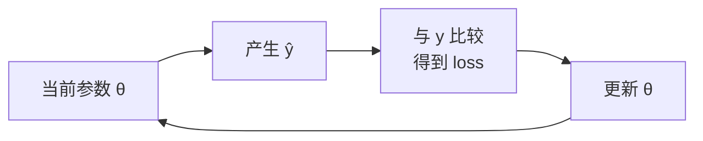

# 01 · AI / ML / DL — 先别管 ChatGPT，我们从第 501 个分子开始

> **本节的一句话任务**  
> 手里有 500 个测过水溶解度的分子。我们想知道：计算机能不能从它们身上学到一些东西，用来预测第 501 个？



*图 1｜本课程原创图，可直接下载 SVG 用于网页或 16:9 PPT。左边是够用的概念地图；右边是后续所有章节都会回到的监督学习闭环。*

---

## 这一节回答什么？

这一节从分子溶解度预测开始，不梳理 AI 历史，也不比较当前大模型。

我们先解决三个问题：

1. AI、Machine Learning、Deep Learning 是什么关系？
2. 一个化学问题怎样变成机器可以学习的问题？
3. `sample / representation / target / model / parameter / prediction / loss / optimization` 各自在流程的哪个位置？

### 课后应记住的 3 件事

1. **Model 是一个可学习的函数，不是答案仓库。**
2. **分子是研究对象；representation `x` 才是模型实际收到的输入。**
3. **模型输出 prediction `ŷ`；训练时用 target `y` 衡量它错了多少，再更新 parameters。**

### 建议教学顺序

| 时间 | 教师做什么 | 学生做什么 | 过关信号 |
|---:|---|---|---|
| 0–2 min | 抛出“第 501 个分子” | 先猜要给机器什么 | 能说出“结构”和“实测溶解度” |
| 2–4 min | 给 AI ⊃ ML ⊃ DL 的够用地图 | 判断 ChatGPT 在哪一层 | 不再把 AI 等同于 LLM |
| 4–10 min | 沿溶解度任务认 8 个角色 | 把术语贴回流程图 | 能区分 `x / y / ŷ / θ` |
| 10–12 min | 做一个数值小例子 | 手算一次误差 | 知道 loss 不是“模型有多笨” |
| 12–15 min | 换成 reaction yield 迁移 | 独立标注新任务 | 能用自己的科研问题复述 |

---

## 1. 先把第 501 个分子摆上桌

假设我们有 500 条记录。每条记录包含：

- 一个分子的结构；
- 在规定实验条件下测得的 aqueous solubility；
- 由结构计算或编码得到的若干数字。

现在来了第 501 个分子。实验还没做，我们希望先得到一个**有依据、可检验、会出错**的估计。

```text
500 个已测分子：structure → representation + measured solubility
                               │
                               └── 学到一个可预测关系？

第 501 个分子：structure → representation → predicted solubility
```

Delaney 在 2004 年发表的 ESOL 工作，使用 **2874 条实测溶解度**，以 **9 个由分子结构得到的性质**建立线性回归模型；论文报告最显著的项包括 calculated logP，随后是 molecular weight、芳香重原子比例和 rotatable bonds。[^esol-pubmed] 后来的 DeepChem 示例也保留了这套数据，方便复现分子性质预测流程。[^deepchem-esol]

我们想知道的是：

> **模型能否把在已测分子中学到的关系，带到一个没有参与训练的新分子上？**

### 一点化学上的严谨

水溶解度不是脱离条件的“分子身份证号”。温度、pH、晶型、盐型、测量方法都会影响结果。入门课暂时把它写成一个标量 `y`，是为了看清监督学习骨架；做真实研究时，数据定义和实验条件必须一起审计。

<details>
<summary><strong>给学得快的人：ESOL 里的数值到底是什么？</strong></summary>

ESOL 讨论的溶解度通常写成 `logS`，即以 mol/L 为单位的溶解度取十进对数。于是 `logS = -3` 对应约 `10⁻³ mol/L`。对数尺度能把跨多个数量级的溶解度放到更便于建模和比较的范围。

这不意味着所有 solubility dataset 都使用完全相同的实验条件或清洗规则。论文中的数据集构建与验证方式仍要回到原文查看。[^esol-doi]

</details>

**本小节来源（3）**：ESOL 原论文 / PubMed 索引[^esol-pubmed][^esol-doi]；DeepChem 官方 ESOL 示例[^deepchem-esol]。

---

## 2. AI、ML、DL：先拿一张够用的地图

第一次见到这三个缩写，很容易把它们当三款并列软件。对本课程，先用下面这张包含关系图：



这是一张**教学地图**，不是要解决所有学术分类争议。它足以让我们不犯三个常见错误：

- AI 不等于 ChatGPT；
- AI 系统不一定都靠机器学习，规则系统也曾是重要路线；
- Deep Learning 没有另起一套学习宇宙，它仍在做数据、预测、误差与更新。

### Artificial Intelligence · AI

AI 是目标范围最大的一层。NIST 的 AI Risk Management Framework 讨论的 AI system，覆盖能够针对人给定目标产生预测、建议或决策等输出的工程系统。[^nist-airmf]

对化学研究者，AI 可能出现在不同位置：

- 从谱图辅助判别结构；
- 从分子表示预测性质；
- 在候选空间里排序下一批实验；
- 调用数据库、计算程序或仪器接口完成工作流。

这些都不自动意味着“用了大语言模型”。

### Machine Learning · ML

机器学习关心的是：不把所有判断规则逐条写死，而是让模型从数据中估计一个可泛化的关系。

对监督学习，最小骨架是：

```math
\hat{y}_i = f(x_i; \theta)
```

- `xᵢ`：第 `i` 个样本的输入 representation；
- `f`：模型采用的函数形式；
- `θ`：模型可以学习的 parameters；
- `ŷᵢ`：模型给出的 prediction；
- `yᵢ`：训练时已知的 target。

scikit-learn 的监督学习文档把诸多回归和分类方法放在同一类接口下：用输入和已知目标拟合 estimator，再对新输入进行预测。[^sklearn-supervised] D2L 的线性回归章节则从数据、模型、损失与优化四部分构造了同一条训练主线。[^d2l-linear]

### Deep Learning · DL

深度学习通常以多层神经网络为模型，可以表达复杂函数，也常常学习中间 representation。Goodfellow、Bengio 与 Courville 的开放教材系统整理了这一范式；D2L 则以可运行代码组织了从线性模型到深层网络的路线。[^deep-learning-book][^d2l-intro]

第一小时不需要钻进网络结构。先记住：

> **模型可以从线性回归换成 GNN、3D equivariant model 或更大的网络，但 `x → ŷ → loss → update θ` 的角色关系仍然在。**

**本小节来源（4）**：NIST AI RMF[^nist-airmf]；scikit-learn 官方监督学习指南[^sklearn-supervised]；D2L[^d2l-intro]；*Deep Learning* 开放教材[^deep-learning-book]。

---

## 3. 别背八个名词：把它们分成三组角色

八个词一次排开很像生词表。更好的办法是问三轮：

```text
数据是什么？      Sample · Representation · Target
谁在做预测？      Model · Parameter · Prediction
怎么利用错误？    Loss · Optimization
```

### A. 数据：我们把什么交给模型？

#### 1) Sample · 一条数据对应谁？

在 ESOL 式任务里，一个 sample 是一个带测量记录的分子。

化学里的 sample 也可能是：

| 任务 | 一个 sample | 可能的 target |
|---|---|---|
| 分子性质预测 | 一个分子 | logS、毒性、带隙 |
| 反应结果预测 | 一条反应记录 | 产率、产物类别 |
| 光谱分析 | 一张谱或一个峰组 | 结构、浓度、组分 |
| 晶体 / 材料建模 | 一个结构或构型 | 能量、力、稳定性 |

“一个 sample” 是数据建模的单位，不一定等于“一个文件”“一行 CSV”或“一个原子”。

#### 2) Feature / Representation `x` · 模型实际看见什么？

人看到苯环、官能团和立体构型；普通模型接口最终要收到数字张量。



这里要把两件事分开：

> **Molecule 是研究对象；representation `x` 是我们选择让模型看到它的方式。**

同一分子换一种 representation，模型能利用的信息、归纳偏好和成本都可能改变。RDKit 文档展示了从分子结构计算 descriptors、fingerprints 和图相关信息的常见工具；MoleculeNet 则把不同分子任务、表示和评估协议放进统一 benchmark。[^rdkit-book][^moleculenet]

#### 3) Label / Target `y` · 我们希望它学会回答什么？

本例中：

```text
y = measured aqueous solubility (logS)
```

`y` 不是“宇宙真理”，而是一条带单位、条件、测量误差和数据出处的记录。模型学到的是数据中被定义和观测出来的 target。

### B. 预测：谁把输入变成答案？

#### 4) Model `f` · 一个可学习的函数

```math
\hat{y} = f(x; \theta)
```

模型可以是一条直线、随机森林、神经网络或图神经网络。先不要按“高级程度”排序，先看它是否适合数据、任务和验证方式。

#### 5) Parameter `θ` · 训练会改的内部数值

最简单的模型：

```math
\hat{y}=wx+b
```

`w` 和 `b` 是 parameters。神经网络只是把可调参数变得更多、组织方式变得更复杂；“训练中会被数据更新”这一身份没有改变。

> **容易混淆：parameter 由训练学习；learning rate、batch size 等 hyperparameter 通常由人或搜索过程选择。**

#### 6) Prediction `ŷ` · 模型此刻给出的估计

帽子 `^` 用来区分预测和实验记录：

```text
y   = 实验记录的 target
ŷ   = 模型给出的 prediction
```

比如某分子实测 `y = -3.1`，模型给出 `ŷ = -2.4`。`-2.4` 不是“机器算出的真相”，只是当前模型在当前 representation 下的估计。

### C. 学习：错误怎样变成下一次更新？

#### 7) Loss `L` · 把“错多少”写成可优化的数

回归任务最容易理解的两种单样本误差：

```math
\text{absolute error}=|\hat{y}-y|
```

```math
\text{squared error}=(\hat{y}-y)^2
```

若 `y=-3.1`、`ŷ=-2.4`：

```text
absolute error = |-2.4 - (-3.1)| = 0.7
squared error  = 0.7² = 0.49
```

它们都在度量差距，但对大误差的敏感程度不同。入门阶段不用争“谁最高级”，先记住：

> **Loss 定义了训练时什么叫“更好”；它是目标的数学化，不是科研价值的完整替身。**

#### 8) Optimization · 利用 loss 调整 parameters



Optimization 是寻找更合适参数的过程。下一章会把 batch、epoch 和 learning rate 放进这个循环；这里不推导 backpropagation，也不参观 optimizer 动物园。

**本大节来源（4）**：D2L 线性回归与优化主线[^d2l-linear]；scikit-learn 监督学习与术语接口[^sklearn-supervised][^sklearn-glossary]；RDKit 分子表示工具文档[^rdkit-book]；MoleculeNet 分子机器学习 benchmark[^moleculenet]。

---

## 4. 把八个词塞回同一个 ESOL 式任务

| 角色 | ML 术语 | 在溶解度预测里 | 开口自测 |
|---|---|---|---|
| 数据 | Sample | 一个带测量记录的分子 | “一条数据是谁？” |
| 数据 | Representation `x` | descriptors / fingerprint / graph / 3D 等 | “模型到底收到什么数字？” |
| 数据 | Target `y` | 实验测得的 logS | “答案由谁、在什么条件下测得？” |
| 预测 | Model `f` | 从表示映射到 logS 的函数 | “函数输入输出是什么？” |
| 预测 | Parameter `θ` | 训练中被调整的权重、偏置等 | “什么数会被数据改掉？” |
| 预测 | Prediction `ŷ` | 模型估计的 logS | “这是真值还是估计？” |
| 学习 | Loss `L` | 预测与实测差距的数值目标 | “模型在努力压低什么？” |
| 学习 | Optimization | 根据 loss 更新 `θ` | “错误怎样影响下一次？” |

### 一条样本从头走一遍

```text
sample #137
  molecule: 某个已测有机小分子
      ↓ representation
  x = [calculated logP, MW, aromatic proportion, rotatable bonds, ...]
      ↓ model f(x; θ)
  ŷ = -2.4 log mol/L
      ↕ compare
  y = -3.1 log mol/L
      ↓
  loss = chosen_error(ŷ, y)
      ↓
  optimizer uses loss information to update θ
```

这条链条里没有任何一步等于“AI 理解了溶解”。它做的是一个更具体、也更可检验的事：从选定 representation 到 target 建立预测关系。

---

## 5. 现场互动：不考定义，考你会不会拆任务

### Round 1 · 全班一起做（60 秒）

屏幕只显示：

```text
molecular representation → aqueous solubility
```

依次点名：

1. sample 是谁？
2. `x` 是什么？至少说出两种可能表示。
3. `y` 和 `ŷ` 有什么区别？
4. `θ` 在哪里？谁会改它？
5. 如果没有实验 `y`，这条新数据能不能直接用于监督训练？

### Round 2 · 换题但不换骨架（90 秒）

```text
reactants + conditions → reaction yield
```

学生两人一组，填下面的小卡：

| Sample | `x` | `y` | Model output `ŷ` | 可能的数据坑 |
|---|---|---|---|---|
| 一条反应记录 | 反应物表示 + 条件 | 实验产率 | 预测产率 | 失败实验没记录、实验室批次差异…… |

### Round 3 · 给计算机专业学生的加试（可选 60 秒）

问：

> 同一个 molecule 用 descriptor vector 和 molecular graph 表示时，`f` 的接口、模型归纳偏好与可利用信息会怎样变化？

预期不是答出完整 GNN，而是意识到：**representation 与 model architecture 必须彼此匹配。**

### 教师观察清单

- 如果学生把 `molecule` 直接等同 `x`：回到 representation 分叉图。
- 如果学生把 `ŷ` 当“正确答案”：让他指出实验 `y` 在哪里。
- 如果学生说“模型参数就是 learning rate”：把 parameter / hyperparameter 分开。
- 如果学生只会在 ESOL 上回答：立刻换成产率、光谱或材料能量。

---

## 6. 下一节要解决的问题：500 条为什么不能全拿去练？

“数据越多越好”听起来没错，但只说了一半。

如果 500 个分子全部用于更新模型，然后还用这 500 个分子给模型打分，我们只知道：

> 它对做过的题掌握得怎么样。

我们真正关心的是：

> **它会不会第 501 题？**

下一章会把训练循环跑起来，然后故意把一部分数据藏好。不是因为舍不得用，而是因为我们需要一场模型没有提前见过答案的考试。

---

## 7. 常见误解：现场拆，不留到考试后

### “AI 就是 ChatGPT”

不对。LLM 是现代 AI 的重要分支，但这节课讨论的监督学习骨架也适用于线性回归、随机森林、GNN 等许多模型。

### “把 SMILES 丢进去，模型就看见了分子”

不够准确。SMILES 是一种字符串表示；还要看 tokenization、encoder 和模型怎样处理它。同一分子甚至可以有多个合法 SMILES 字符串。

### “模型输出就是答案”

模型输出是 `ŷ`。实验记录是 `y`。二者都可能有不确定性，但身份不能混。

### “参数越多，知识越多，模型就越好”

参数量只描述模型容量的一部分。数据质量、任务定义、representation、优化、验证方式和分布变化都会决定结果是否可信。

### “Loss 低就说明化学问题解决了”

Loss 只对应被选择的训练目标。它可能没有覆盖实验误差、适用域、成本、安全性或真正部署场景。

---

## 8. 本节不要贪

暂时不展开：

- backpropagation 推导；
- CNN / RNN / Transformer 的历史；
- Adam / RMSProp / momentum 对比；
- supervised / unsupervised / reinforcement learning 的完整分类；
- 大模型参数量竞赛。

这些内容后面会用到。现在先把这条关系看明白：

```text
研究对象 → representation x → model f(x; θ) → prediction ŷ
                                            ↕ target y
                                               ↓
                                              loss
```

---

## 9. 本节最后只留三句话

1. **Machine Learning 从数据中学习可用于预测的关系。**
2. **监督学习的最小骨架是 `x → model → ŷ`，训练时还有已知 target `y`。**
3. **训练利用 loss 提供的纠错信号，反复更新 parameters。**

### 30 秒出口题

不看上文，用自己的研究对象完成一句话：

> 我的一条 sample 是 ______；模型看到的 `x` 是 ______；我希望预测的 `y` 是 ______；最担心的数据问题是 ______。

如果第四个空一时填不出，没关系。下一章会给你一个很常见的答案：**把考试题泄露进练习题。**

---

## 10. 给网页、PPT 与授课者的提取说明

### 网站最终应出现什么？

- **一句话**：模型不是答案仓库，而是把 representation `x` 映射为 prediction `ŷ` 的可学习函数。
- **一张主图**：[AI / ML / DL 与第 501 个分子 SVG](../assets/teaching/01-ai-ml-dl-and-501.svg)。
- **一个交互**：把 `sample / x / y / model / θ / ŷ / loss / optimization` 拖到流程图正确位置；任务可在 solubility 与 reaction yield 间切换。
- **关键概念**：Sample、Representation、Target、Model、Parameter、Prediction、Loss、Optimization。

### 适合拆成 PPT 的 6 页

1. 500 个已测分子 → 第 501 个？
2. ESOL 的真实数据案例。
3. AI ⊃ ML ⊃ DL 的够用地图。
4. 一个分子为什么不等于一个 `x`。
5. `x → f(x; θ) → ŷ` 与 `y → loss`。
6. 换成 reaction yield 的现场迁移题。

### 讲者备注

“猜”“校准”“考试”用来建立直觉。讲完类比后，回到精确词：prediction、parameter update、validation / test。类比不能替代定义。

---

## 11. 参考资料与可核验出处

### A. Running example：ESOL（3）

1. Delaney 原论文（DOI）[^esol-doi]
2. PubMed 论文索引与摘要（数据规模、9 个分子性质、主要变量、验证概述）[^esol-pubmed]
3. DeepChem 官方 Delaney / ESOL 示例（可复现入口）[^deepchem-esol]

### B. AI / ML / DL 的概念地图（4）

1. NIST AI Risk Management Framework 1.0[^nist-airmf]
2. scikit-learn 官方监督学习指南[^sklearn-supervised]
3. *Dive into Deep Learning* 导论[^d2l-intro]
4. Goodfellow, Bengio & Courville, *Deep Learning* 开放教材[^deep-learning-book]

### C. 监督学习的八个角色（4）

1. D2L 线性回归：数据、模型、loss 与 minibatch SGD[^d2l-linear]
2. scikit-learn 官方术语表[^sklearn-glossary]
3. RDKit Book：分子对象、descriptors 与 fingerprints[^rdkit-book]
4. MoleculeNet：分子机器学习数据集、任务与评估框架[^moleculenet]

> 引用原则：正文只陈述来源真正支持的内容；教学数字、类比和原创图明确标成课程设计，不伪装成论文结论。

[^esol-doi]: Delaney, J. S. “ESOL: Estimating Aqueous Solubility Directly from Molecular Structure.” *Journal of Chemical Information and Computer Sciences* 44, 1000–1005 (2004). https://doi.org/10.1021/ci034243x
[^esol-pubmed]: PubMed, PMID 15154768, ESOL abstract and bibliographic record. https://pubmed.ncbi.nlm.nih.gov/15154768/
[^deepchem-esol]: DeepChem official repository, Delaney example README. https://github.com/deepchem/deepchem/tree/master/examples/delaney
[^nist-airmf]: Tabassi, E. (ed.). *Artificial Intelligence Risk Management Framework (AI RMF 1.0)*, NIST AI 100-1 (2023). https://doi.org/10.6028/NIST.AI.100-1
[^sklearn-supervised]: scikit-learn User Guide, “Supervised learning.” https://scikit-learn.org/stable/supervised_learning.html
[^sklearn-glossary]: scikit-learn User Guide, “Glossary of Common Terms and API Elements.” https://scikit-learn.org/stable/glossary.html
[^d2l-intro]: Zhang, A. et al. *Dive into Deep Learning*, “Introduction.” https://d2l.ai/chapter_introduction/index.html
[^d2l-linear]: Zhang, A. et al. *Dive into Deep Learning*, “Linear Regression.” https://d2l.ai/chapter_linear-regression/linear-regression.html
[^deep-learning-book]: Goodfellow, I., Bengio, Y. & Courville, A. *Deep Learning*. MIT Press (2016), open web edition. https://www.deeplearningbook.org/
[^rdkit-book]: RDKit documentation, “The RDKit Book.” https://www.rdkit.org/docs/RDKit_Book.html
[^moleculenet]: Wu, Z. et al. “MoleculeNet: a benchmark for molecular machine learning.” *Chemical Science* 9, 513–530 (2018). https://doi.org/10.1039/C7SC02664A

---

## English summary

We begin with a concrete question: can 500 measured molecules help us predict the aqueous solubility of molecule 501? In supervised learning, a representation `x` enters a learnable model `f(x; θ)` and produces a prediction `ŷ`. During training, a known target `y` lets us compute a loss; optimization uses that signal to update the learnable parameters `θ`. The molecule itself is not the same thing as its representation, and a prediction is not a measured truth. Deep learning changes the model family and often the representation-learning capacity, but it remains within this data–prediction–loss–update logic.
