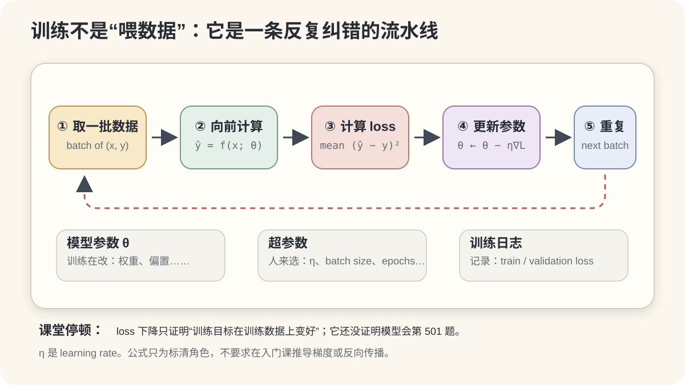
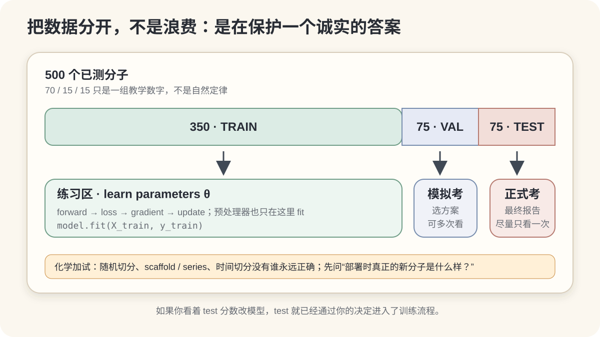
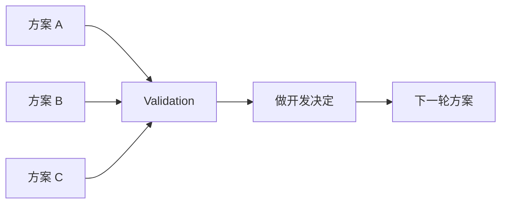

# 02 · 一个 AI 模型到底是怎么训练出来的？

上一节把零件认了一遍。现在把机器开起来。

> **本节的一句话任务**  
> 让模型在 500 个已测分子上反复预测、计算误差并更新参数；再用一组从未参与开发的数据检查它会不会第 501 题。



*图 1｜本课程原创训练闭环图。SVG 是 16:9，可直接用于网页或 PPT；公式用于标清角色，不要求在入门课推导梯度。*

---

## 这一节回答什么？

1. 一次 prediction 怎样变成一次 parameter update？
2. batch、epoch、learning rate 各控制什么？
3. 为什么 training loss 下降，不足以证明模型会预测新分子？
4. Train / Validation / Test 为什么必须分工？
5. 为什么化学数据不能满足于“随机切一下”？

### 课后应记住的 3 件事

1. **Loss 衡量当前预测在选定目标下错多少；training 用这个信号更新 parameters。**
2. **Training set 学参数，validation set 做开发选择，test set 留给最终独立评估。**
3. **Test data 的价值来自没有参与前面的选择；哪怕不算 gradient，反复偷看也会污染它。**

### 建议教学顺序

| 时间 | 教师动作 | 学生活动 | 过关信号 |
|---:|---|---|---|
| 0–5 min | 让一条样本走完 prediction → loss | 手算一次 error | 能区分 `y` 与 `ŷ` |
| 5–10 min | 演示 parameter update 与 learning rate | 判断三种步长 | 知道 learning rate 不是“知识增长率” |
| 10–13 min | 把 batch / epoch 接入循环 | 数 350 条数据有几次 update | 不把 batch size 当数据总量 |
| 13–18 min | 打开 Train / Validation / Test 图 | 决定三类数据能做什么 | 不再把 validation 当 test 同义词 |
| 18–22 min | 给出 chemistry split 反例 | 选择 random / scaffold / time | 先说部署场景，再说 split 名称 |

---

# Part A · TRAIN：模型怎样从“猜错”变成“少错一点”？

## 1. 训练把预测误差反馈给参数

对一个 batch 里的第 `i` 个分子：

```math
\hat{y}_i=f(x_i;\theta)
```

训练循环可以压成五步：

```mermaid
flowchart LR
  B[① 取一个 batch<br/>(x, y)] --> P[② model 产生 ŷ]
  P --> L[③ 比较 ŷ 与 y<br/>计算 loss]
  L --> U[④ 更新 parameters θ]
  U --> R[⑤ 取下一个 batch]
  R --> P
```

刚初始化的 `θ` 没有理由一上来就适合溶解度任务。第一轮预测很差，并不丢脸；如果模型、数据和优化设置允许，它能否从误差中持续改进，才是训练要回答的事。

### 一条样本的数值小剧场

假设实验记录：

```text
y = -3.0 log mol/L
```

模型当前预测：

```text
ŷ = -1.8 log mol/L
```

若课堂用 squared error：

```math
(\hat{y}-y)^2=(-1.8-(-3.0))^2=1.44
```

这 `1.44` 不是“模型综合能力 1.44”，也不是论文最终报告指标。它只是在当前样本、当前单位和当前 loss 定义下的误差数值。

真实训练通常会把一个 batch 中多个样本的 loss 聚合，例如 mean squared error：

```math
L_{\text{batch}}=\frac{1}{B}\sum_{i=1}^{B}(\hat{y}_i-y_i)^2
```

其中 `B` 是 batch 中的样本数。

> **课堂停顿**：Loss 是训练要优化的代理目标。科研真正关心的可能还包括误差分布、适用域、测量噪声、外推能力、实验成本和安全性。

**本小节来源（3）**：D2L 线性回归[^d2l-linear]；D2L 优化导论[^d2l-optimization]；Goodfellow 等教材的深度模型优化章节[^dlbook-optimization]。

---

## 2. Parameter：训练真正会改的东西

为了看清角色，我们故意拿一个简化模型：

```math
\hat{y}=w_1x_1+w_2x_2+b
```

可以把：

- `x₁` 想成 standardized calculated logP；
- `x₂` 想成 standardized molecular weight；
- `w₁, w₂, b` 看成模型 parameters。

这**不是声称 ESOL 真实模型只有两个变量**。它只是课堂显微镜：参数少，更新动作看得见。

```text
model family:  linear function
parameters θ:  [w₁, w₂, b]          ← training 会改
input x:       [x₁, x₂]             ← 来自 representation
prediction:    ŷ                     ← 当前输出
```

如果采用 gradient-based optimization，一次更新常写成：

```math
\theta \leftarrow \theta-\eta\nabla_\theta L
```

第一小时不推导 `∇θL`。只读懂角色：

- `∇θL` 提供“参数往哪边动，loss 可能下降”的局部信息；
- `η`（eta）是 learning rate，控制这一步走多大；
- 更新完成后得到新的 `θ`，再做下一轮 prediction。

### 仪器校准类比：有用，但别用过头

| 类比 | 机器学习对应物 |
|---|---|
| 待校准仪器 | model |
| 校准样品 | training samples |
| 已知参考值 | target `y` |
| 可调旋钮 | parameters `θ` |
| 读数偏差 | prediction error / loss |

类比到此为止。真实模型不是物理仪器，loss landscape 也可能非常复杂；这个类比只负责解释“为什么参数可以利用误差被反复调整”。

**本小节来源（3）**：D2L 线性回归从零实现[^d2l-linear-scratch]；D2L gradient descent[^d2l-gd]；Goodfellow 等的数值优化背景[^dlbook-numerical]。

---

## 3. Learning rate：不是“学了多少知识”

Learning rate 最容易被名字骗到。

它更接近：

> **这一次 parameter update 的步长尺度。**

想象你在雾里沿山坡找低处：

```text
太小：  · · · · · · · · · →      稳，但可能慢
合适：  ·   ·   ·   ·  →           能较快下降
太大：  ←       →       ←          可能跨过低处、震荡或发散
```

小 learning rate 不一定最终最好，大 learning rate 也不一定必然失败；loss landscape、optimizer、batch noise 和 schedule 都会影响结果。这里先建立步长的直觉，不展开不同 optimizer 的细节。

### 15 秒判断题

下面哪句话更准确？

- A. learning rate = 模型每轮学会多少化学知识
- B. learning rate = 每次参数更新的步长尺度

答案是 B。A 把一个优化超参数拟人化了。

**本小节来源（3）**：D2L gradient descent[^d2l-gd]；D2L learning-rate scheduling[^d2l-lr]；Goodfellow 等的 optimization chapter[^dlbook-optimization]。

---

## 4. Batch 与 Epoch：把“反复”数清楚

前面的示意像模型一次只看一个分子。实际训练常一次处理一小批样本。

### Batch · 一次 update 用多少样本

假设 training set 有 350 个分子，batch size = 50：

```text
50 → batch 1 → update θ
50 → batch 2 → update θ
50 → batch 3 → update θ
50 → batch 4 → update θ
50 → batch 5 → update θ
50 → batch 6 → update θ
50 → batch 7 → update θ
```

所以：

```text
7 batches ≈ 1 epoch
```

### Epoch · training set 大致完整走过一遍

`epoch = 1` 不等于“参数只更新一次”。上面的例子中，一个 epoch 有 7 次 update。

若不能整除，例如 350 个样本、batch size = 64，常见实现会得到 5 个完整 batch 加 1 个较小 batch；是否丢弃最后一个 batch 取决于具体设置。

### 三个词放在一张表里

| 概念 | 控制 / 描述什么 | 不是什么 |
|---|---|---|
| Batch size | 一次 update 汇总多少 samples | 整个 dataset 的大小 |
| Epoch | training set 大致被完整遍历几次 | 模型“学完一章” |
| Learning rate | 每次 parameter update 的步长尺度 | 学到的知识比例 |

<details>
<summary><strong>给计算机专业学生：为什么常用 minibatch？</strong></summary>

Minibatch 在计算效率、内存占用与梯度估计噪声之间提供了工程折中，也能利用向量化和并行硬件。batch size 改变后，优化动态和合适的 learning rate 也可能变化；它不是只影响“每轮多快”。入门课不进一步展开规模律或分布式训练。

</details>

**本小节来源（3）**：D2L minibatch SGD[^d2l-minibatch]；D2L 数据读取与 minibatch[^d2l-linear-scratch]；PyTorch DataLoader 官方文档[^pytorch-data]。

---

## 5. 用伪代码看完整训练循环

```text
for each epoch:
    shuffle training data（常见做法）
    for each batch (x, y):
        ŷ = model(x; θ)              # prediction
        loss = compare(ŷ, y)         # quantify error
        gradient = how loss changes with θ
        θ = update(θ, gradient, η)    # optimization step
```

模型、loss、optimizer 以后都可以换。入门时，先能指出：

- **数据从哪里进来；**
- **prediction 在哪里产生；**
- **target 在哪里参与；**
- **parameter 在哪里被更新；**
- **循环为什么要 repeat。**

### 训练日志应该看什么？

最简单的日志至少区分：

```text
epoch | train loss | validation loss
```

只看 training loss，会制造一个危险错觉：它一直下降，于是模型一定越来越可靠。

事实是，模型可能越来越擅长训练数据，同时在未见数据上停止改善甚至变差。下一章会系统讲 underfitting / overfitting；本章先把防线建好：**独立的数据角色。**

---

# Part B · DATA SPLIT：为什么要故意藏起一部分数据？



*图 2｜本课程原创数据分工图。70 / 15 / 15 是教学示例，不是固定配方。图的重点是职责，不是比例。*

## 6. 训练数据不能同时当最终评估

假设把 500 个分子全部拿去训练：

```text
500 molecules
     ↓
all used to update θ
     ↓
evaluate on the same 500
```

这个分数只告诉我们模型在见过的数据上表现如何。

scikit-learn 官方文档把“在同一数据上学习参数并测试”直接称为 methodological mistake：一个只会重复见过标签的模型，也可能在这些数据上得到完美分数，却无法对 unseen data 做出有用预测。[^sklearn-cv]

所以我们把问题从“训练分数多高”改成：

> **面对没有参与开发的新分子，它还能表现好吗？**

这就是 generalization 问题，也是 Train / Validation / Test 分工的理由。

### 考试类比哪里好用？

```text
Train       = 练习题
Validation  = 模拟考试，帮助决定复习策略
Test        = 最终正式考试
```

### 类比哪里会失真？

人可能真正理解一道题；统计模型则从数据分布中学习可利用模式。化学样本之间还可能高度相似、共享 scaffold、来自同一批次。于是“题号不同”并不保证“题目独立”。后面还要检查 split 是否代表真正部署场景。

**本小节来源（3）**：scikit-learn cross-validation 指南[^sklearn-cv]；scikit-learn common pitfalls[^sklearn-pitfalls]；D2L generalization 章节[^d2l-generalization]。

---

## 7. Training set：真的用于学习 parameters

Training set 进入：

```text
x_train → model → ŷ_train
                   ↕ y_train
                     ↓
                  train loss
                     ↓
                  update θ
```

它承担的核心职责：

- 拟合模型 parameters；
- 为每个 batch 计算训练目标；
- 提供 gradient / update 所需信息。

### 一个常被漏掉的细节：预处理也会“学习”

如果你要 standardize descriptors，均值和标准差只能从 training set 估计：

```text
正确：split → fit scaler on Train → transform Train / Val / Test
错误：fit scaler on all data → split
```

feature selection、缺失值填补、PCA 等步骤也一样：凡是会从数据估计状态的操作，都可能把 validation / test 信息泄回训练流程。scikit-learn 官方 common pitfalls 对此给出明确示例，并推荐把预处理和 estimator 放入 Pipeline。[^sklearn-pitfalls]

> **实验室版本的检查句**：这个步骤有没有“看全体数据以后再决定一个数”？如果有，先问它是否必须只在 Train 上 fit。

---

## 8. Validation set：不直接改 θ，但会改变我们的决定

Validation set 常用于：

- 选择 model family / architecture；
- 调 learning rate、regularization、batch size 等 hyperparameters；
- 决定训练多少 epochs；
- early stopping；
- 选择 checkpoint；
- 比较不同 representation 或 preprocessing pipeline。



它没有直接参与这一轮的 gradient update，但它通过**人的选择**进入了开发流程。

这也是为什么 validation 不能冒充最终独立证据：反复比较几十个方案后，研究者也可能逐渐“过拟合 validation set”。模型选择中由此产生的偏差，是统计学习里认真研究的问题。[^cawley-talbot]

### 数据少怎么办？

可以在 training portion 内使用 cross-validation 估计和选择方案，同时把 final test set 继续封存。具体做法取决于样本量、分组结构与时间顺序；第 03 章会继续讲。

---

## 9. Test set：最好真的最后才打开

理想流程：

```text
Train
  ↓ learn parameters

Validation / CV inside development data
  ↓ choose model, hyperparameters, checkpoint, preprocessing

freeze the complete pipeline
  ↓
Test
  ↓ one final, independent evaluation
```

### “我又没用 test 算 gradient，看看怎么了？”

问题不在有没有 gradient，而在 test information 是否影响了你的开发决定。

```text
Model A → test score 0.72
Model B → test score 0.75
Model C → test score 0.81
```

如果因为 test score 选择 C，test 已经承担了 validation 的角色。你下一次再报告它，就不能装作这是完全独立的最终评估。

> **每次根据 Test 结果改方案，Test 的独立性都会减少一点。**

### 推荐的“封条”

在打开 test 之前，写下：

- representation 与 preprocessing；
- model / hyperparameters；
- checkpoint 选择规则；
- primary metric；
- test inclusion / exclusion criteria；
- 随机种子或重复实验方案。

这不是为了增加仪式感，而是减少“看见答案以后再改规则”的空间。

**Train / Validation / Test 三节来源（4）**：scikit-learn cross-validation[^sklearn-cv]；scikit-learn data leakage[^sklearn-pitfalls]；D2L generalization[^d2l-generalization]；Cawley & Talbot 关于 model-selection overfitting[^cawley-talbot]。

---

## 10. 500 个分子怎么分？比例不是圣经

为了画图，可以示意：

```text
500 molecules

350 → Train
 75 → Validation
 75 → Test
```

`70 / 15 / 15` 只是画图用的比例。实际划分取决于：

- 总样本量与 target 分布；
- 是否有天然 group（同一 scaffold、同一 compound、同一实验批次）；
- 是否必须按时间模拟未来；
- hyperparameter search 的规模；
- 是否采用 cross-validation；
- 最终部署对象与需要的统计精度。

与其背比例，不如先写一句 deployment question：

> **模型未来真正会遇到的“新”，到底是同系列的新 analogue、新 scaffold、未来批次，还是另一家实验室的数据？**

然后再设计 split。

---

## 11. 化学里的 split：题号不同，不代表化学上独立

分子数据有结构。简单 random split 可能把高度相似的 analogues 分到 Train 和 Test 两侧，让测试更像“同一道题换了一个取代基”。

### 三种常见设计，各自回答不同问题

| Split | 大致怎么分 | 更接近回答什么 | 主要风险 / 代价 |
|---|---|---|---|
| Random split | 样本随机分配 | 同一总体随机抽样下的表现 | 相似分子跨集合，结果可能乐观 |
| Scaffold / series-aware split | 按骨架或化学系列分组 | 跨结构系列迁移 | scaffold 定义不是部署场景本身；组间仍可能相似 |
| Time split | 早期数据训练，后期数据测试 | 用过去预测未来 | 数据生成流程也随时间变，样本量可能不均 |

MoleculeNet 把 scaffold split 用作多项分子任务的评估方式，意图把二维结构框架不同的分子放进不同子集，并指出它通常比 random split 更具挑战。[^moleculenet] Sheridan 则专门讨论了 time-split cross-validation 如何用于估计 prospective prediction。[^sheridan]

但不要从“random split 不是万能的”跳到“scaffold split 就是万能的”。正确顺序是：

```text
未来使用场景
   ↓
什么变化最关键？结构系列 / 时间 / 实验室 / 仪器 / 条件
   ↓
选择能模拟这种变化的 split
   ↓
检查 Train / Val / Test 的分布与重叠
```

### 化学数据泄漏检查单

- 同一 compound 的重复测量是否跨集合？
- 盐型、互变异构体、立体异构体或标准化前后的重复是否跨集合？
- 同一 scaffold / analogue series 是否被拆散？这是否符合部署问题？
- target 相关的后验信息是否混入 descriptors？
- normalization、imputation、feature selection 是否在全数据上 fit？
- 时间戳、实验室、仪器或 batch 信息是否形成隐蔽捷径？
- Test 是否真的代表模型未来要面对的数据？

### 一句话底线

> **Split 写进代码之前，先写清模型要泛化到哪里。**

**本小节来源（4）**：MoleculeNet[^moleculenet]；Sheridan time split[^sheridan]；RDKit Murcko scaffold API[^rdkit-murcko]；scikit-learn 关于非独立同分布数据的 cross-validation 提醒[^sklearn-cv]。

---

## 12. 课堂小游戏：谁碰了 Test set？

### 玩法 · 4 人一组，5 分钟

每组拿到 5 张“行动卡”：

1. 在 Train 上 fit scaler。
2. 看 Validation，选 learning rate。
3. 看 Test，发现不理想，于是增加一个 descriptor。
4. 再看 Validation，选 checkpoint。
5. 冻结 pipeline 后，打开 Test 报告最终结果。

任务：把卡片分成三类。

| 类别 | 含义 |
|---|---|
| ✅ 合理 | 可以进入标准开发流程 |
| ⚠️ 需要说明 | 取决于预注册方案、重复评估设计或数据角色 |
| ❌ 污染 final test | Test 信息影响了模型开发 |

### 标准讨论

- 1、2、4 通常合理；
- 5 是 test 的理想职责；
- 3 把 Test 变成了 Validation。要么承认并重新获得真正独立的 test data，要么停止把原 Test 称为未触碰的最终评估。

### 可运行 notebook

[打开 `01-train-validate-test-playground.ipynb`](../notebooks/01-train-validate-test-playground.ipynb)

Notebook 使用**合成的 ESOL 风格 descriptor 数据**，不冒充真实 ESOL 数据；无需 RDKit 或联网即可：

- 亲手切分 Train / Validation / Test；
- 看不同 learning rate 的 loss 曲线；
- 只用 Validation 选择方案；
- 最后一次打开 Test；
- 故意制造一次 preprocessing leakage，再比较结果。

---

## 13. 一张图复述整节课

```mermaid
flowchart TB
  D[500 measured molecules] --> S{先按部署问题 split}
  S --> TR[TRAIN<br/>fit preprocessing + learn θ]
  S --> VA[VALIDATION<br/>choose / tune / stop]
  S --> TE[TEST<br/>keep sealed]
  TR --> B[batch of x,y]
  B --> P[ŷ = f(x;θ)]
  P --> L[loss(ŷ,y)]
  L --> U[update θ]
  U --> B
  VA --> C[freeze complete pipeline]
  C --> TE
  TE --> R[final report on unseen data]
```

让学生用手指着图回答：

1. `y` 在哪里出现？
2. `θ` 在哪里改变？
3. Validation 怎样影响模型，却不直接算这一轮 gradient？
4. 哪条箭头如果从 Test 回到模型选择，就会污染 final evaluation？

---

## 14. 常见误解

### “Training loss 越低，模型一定越好”

只说明模型更贴合当前 training data 与 objective。它可能过拟合，也可能优化了一个不完全对应科研目标的 loss。

### “Validation 和 Test 都不更新参数，所以作用一样”

不一样。Validation 进入反复选择；Test 用于开发流程冻结后的独立评估。

### “只要 Test 不参与 gradient，我就能一直看”

不对。人的决策也是信息通道。

### “Batch size = 50，所以我只有 50 条训练数据”

不对。它只表示一次 update 使用多少样本；下一个 batch 还会继续。

### “一个 epoch 只更新一次参数”

通常不对。每个 batch 往往对应一次 update；一个 epoch 可包含多个 batches。

### “先对全数据 standardize，再 split 没关系，反正没用 label”

仍可能 leakage。Test distribution 参与了均值、标准差等预处理状态的估计。

### “化学任务一律 scaffold split”

不对。Split 要模拟未来使用场景；scaffold 只是可能的结构分组方案之一。

---

## 15. 本节最后留下四句话

1. **Model = a learnable function.**
2. **Loss measures how wrong current predictions are under a chosen objective.**
3. **Training repeatedly updates parameters to reduce loss on training data.**
4. **Test data stay untouched until the complete development pipeline is fixed.**

### 60 秒出口题

请合上文档，向同桌解释：

> “为什么不能拿训练数据当期末考试？”

过关答案不需要 AI 术语，但应包含两层：

- 做过的题不能证明会做新题；
- Validation 可以帮助选方案，Test 必须保持更独立，才能估计最后方案对未见数据的表现。

---

## 16. 给网页、PPT 与授课者的提取说明

### 网站最终应出现什么？

- **一句话**：训练是 `batch → prediction → loss → update θ → repeat`；Train、Validation、Test 分别用于学习、选择与最终评估。
- **两张主图**：[训练循环 SVG](../assets/teaching/02-training-loop.svg)；[数据分工 SVG](../assets/teaching/02-data-split.svg)。
- **一个交互**：learning-rate 滑块控制小球在 loss curve 上的步长，同时显示 train / validation loss。
- **一个小游戏**：拖动行动卡，判断哪些操作会污染 Test。
- **关键概念**：Parameter、Loss、Optimization、Learning rate、Batch、Epoch、Train、Validation、Test、Leakage。

### 适合拆成 PPT 的 8 页

1. 一张图：batch → prediction → loss → update。
2. 一条样本：`y=-3.0`、`ŷ=-1.8`，loss 怎么来。
3. 参数与超参数：谁被训练改，谁由方案选。
4. learning rate 三种步长。
5. batch / epoch 数数题。
6. 训练下降 ≠ 第 501 个分子预测可靠。
7. Train / Validation / Test 三种职责。
8. Chemistry split：random / scaffold / time 先问部署场景。

### 讲者备注

- 主线只讲直觉；梯度公式用来定位角色，不展开推导。
- “考试”类比讲完，要补一句：化学样本可能相关，题号不同不等于独立。
- 不在这节课展开 optimizer zoo、反向传播和详细 cross-validation。
- 现场一定让学生说一次完整 training loop；听懂与能复述是两回事。

---

## 17. 参考资料与可核验出处

### A. Prediction → Loss → Optimization（4）

1. D2L 线性回归[^d2l-linear]
2. D2L 优化导论与 gradient descent[^d2l-optimization][^d2l-gd]
3. *Deep Learning* 第 8 章：Optimization for Training Deep Models[^dlbook-optimization]
4. D2L learning-rate scheduling[^d2l-lr]

### B. Batch / Epoch（3）

1. D2L minibatch SGD[^d2l-minibatch]
2. D2L 线性回归从零实现的数据迭代示例[^d2l-linear-scratch]
3. PyTorch `torch.utils.data` 官方文档[^pytorch-data]

### C. Train / Validation / Test 与 leakage（4）

1. scikit-learn cross-validation 指南[^sklearn-cv]
2. scikit-learn common pitfalls / data leakage[^sklearn-pitfalls]
3. D2L generalization[^d2l-generalization]
4. Cawley & Talbot：model-selection overfitting[^cawley-talbot]

### D. Chemistry-aware split（4）

1. MoleculeNet[^moleculenet]
2. Sheridan：time-split cross-validation[^sheridan]
3. RDKit Murcko scaffold API[^rdkit-murcko]
4. scikit-learn 对 grouped / time-ordered 数据的 CV 指南[^sklearn-cv]

[^d2l-linear]: Zhang, A. et al. *Dive into Deep Learning*, “Linear Regression.” https://d2l.ai/chapter_linear-regression/linear-regression.html
[^d2l-linear-scratch]: Zhang, A. et al. *Dive into Deep Learning*, “Linear Regression Implementation from Scratch.” https://d2l.ai/chapter_linear-regression/linear-regression-scratch.html
[^d2l-optimization]: Zhang, A. et al. *Dive into Deep Learning*, “Optimization and Deep Learning.” https://d2l.ai/chapter_optimization/index.html
[^d2l-gd]: Zhang, A. et al. *Dive into Deep Learning*, “Gradient Descent.” https://d2l.ai/chapter_optimization/gd.html
[^d2l-minibatch]: Zhang, A. et al. *Dive into Deep Learning*, “Minibatch Stochastic Gradient Descent.” https://d2l.ai/chapter_optimization/minibatch-sgd.html
[^d2l-lr]: Zhang, A. et al. *Dive into Deep Learning*, “Learning Rate Scheduling.” https://d2l.ai/chapter_optimization/lr-scheduler.html
[^dlbook-numerical]: Goodfellow, I., Bengio, Y. & Courville, A. *Deep Learning*, Chapter 4 “Numerical Computation.” https://www.deeplearningbook.org/contents/numerical.html
[^dlbook-optimization]: Goodfellow, I., Bengio, Y. & Courville, A. *Deep Learning*, Chapter 8 “Optimization for Training Deep Models.” https://www.deeplearningbook.org/contents/optimization.html
[^pytorch-data]: PyTorch documentation, `torch.utils.data`. https://pytorch.org/docs/stable/data.html
[^sklearn-cv]: scikit-learn User Guide, “Cross-validation: evaluating estimator performance.” https://scikit-learn.org/stable/modules/cross_validation.html
[^sklearn-pitfalls]: scikit-learn User Guide, “Common pitfalls and recommended practices,” especially data leakage. https://scikit-learn.org/stable/common_pitfalls.html
[^d2l-generalization]: Zhang, A. et al. *Dive into Deep Learning*, “Generalization.” https://d2l.ai/chapter_linear-regression/generalization.html
[^cawley-talbot]: Cawley, G. C. & Talbot, N. L. C. “On Over-fitting in Model Selection and Subsequent Selection Bias in Performance Evaluation.” *Journal of Machine Learning Research* 11, 2079–2107 (2010). https://www.jmlr.org/papers/v11/cawley10a.html
[^moleculenet]: Wu, Z. et al. “MoleculeNet: a benchmark for molecular machine learning.” *Chemical Science* 9, 513–530 (2018). https://doi.org/10.1039/C7SC02664A
[^sheridan]: Sheridan, R. P. “Time-Split Cross-Validation as a Method for Estimating the Goodness of Prospective Prediction.” *Journal of Chemical Information and Modeling* 53, 783–790 (2013). https://doi.org/10.1021/ci400084k
[^rdkit-murcko]: RDKit documentation, `rdkit.Chem.Scaffolds.MurckoScaffold`. https://www.rdkit.org/docs/source/rdkit.Chem.Scaffolds.MurckoScaffold.html

---

## English summary

Supervised training repeatedly takes a batch of training examples, produces predictions, compares them with known targets, computes a loss, and updates learnable parameters. The learning rate controls the update step scale; batch size is the number of samples used for an update; an epoch is approximately one complete pass through the training set. Training data learn parameters, validation data guide model-development choices, and test data should remain untouched until the complete pipeline is fixed. In chemistry, the split must reflect the intended deployment scenario: random, scaffold-aware, series-aware, grouped, and temporal splits answer different generalization questions.
